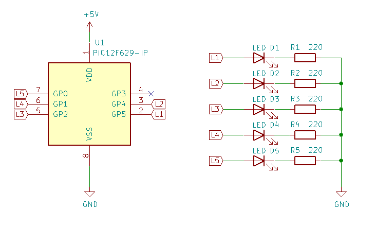

# CandleLEDs
Simple 5 LED Candle

Programa que reproduce la simulación de una llama. 
Inspirado en: https://www.youtube.com/watch?v=tWUz7Yg0Z_g

La versión 1 es la que se asemeja a la del vídeo. Posee el problema de que la secuencia se repite cada pocos segundos.  
La versión 2 añade aleatoriedad a la generación con lo que la secuencia ahora se repite cada 2 minutos.  
La version 3 posee aleatoriedad tanto en la secuencia como en el retardo entre los pasos de cada secuencia.

Clive menciona que en el farol que el muestra usaron PWM. Analizando las imagenes del vídeo parece que lo mas probable es que no y la diferencia en intensidad se deba a la caída en tensión debido a que no usaron resistencias limitadoras por cada LED.

Video:  

En el vídeo mucho no se aprecia porque los LEDs que use eran los únicos que tenía a mano y no son aptos para este proyecto pero quedo, dentro de todo, decente.
Esta armado dentro de un tarro de plástico, tuve que agregar una hoja blanca dentro para que difumara la luz de los LEDs.

Diagrama Esquemático:

